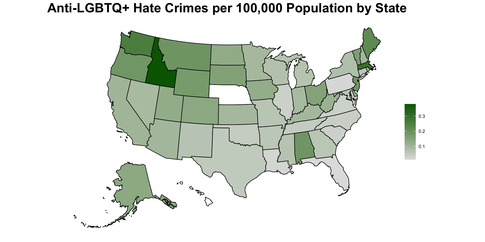

### Maia Vachon, Mai Nguyen and Oliver Reidmiller
---
# Exploring the Correlation Between Religious Affiliations and Anti-LGBT Hate Crimes and Legislation


## Introduction

## Objectives
Research Question

## Data Analysis 
### Data Collection
Provide data sources

### Data Processing 

#### `CSV Files`
```
crime_df <- read.csv('df_anti_lgbt_crime.csv')
lgbt_pop_df <- read.csv('LGBT_State_Pop.csv')
church_df <- read.csv('churchesDf.csv')
state_pop_df <- read.csv('populationData.csv')
affiliation_df <- read.csv('Affiliation Full Data.csv')
education_df <- read.csv('Education Attainment.csv')
race_df <- read.csv('Race-Ethnicity.csv')
unemployment_df <- read.csv('unemployment data.csv')
voting_df <- read.csv('Voting Data.csv')
poverty_df <- read.csv('poverty data.csv')
urban_df <- read.csv('Urban Pop.csv')
```
#### `Merging`
```
crime_df_agg <- crime_df %>% group_by(state_abbr,data_year) %>% summarise(crimes = n())

#Start Merging

#Crime & Churches
merged_df <- merge(crime_df_agg, church_df, by.x = 'state_abbr', by.y = 'STATE')

merged_df <- convert_state_abbreviations(merged_df,'state_abbr')

#Affiliation

merged_df <- merge(merged_df, affiliation_df, by.x = c('State', 'data_year'), by.y = c('State', 'Year'))

#Education
merged_df <- merge(merged_df, education_df, by.x = c('State', 'data_year'), by.y = c('State', 'Year'))


#Race
merged_df <- merge(merged_df, race_df, by.x = c('State', 'data_year'), by.y = c('State', 'Year'))

#LGBT Pop
lgbt_pop_df <- lgbt_pop_df[1:51,-c(1,4)]

colnames(lgbt_pop_df) <- c('State','LGBT_Pop')

merged_df <- merge(merged_df, lgbt_pop_df, by = 'State')
merged_df$LGBT_Pop <- as.numeric(merged_df$LGBT_Pop)

#Add Population


colnames(state_pop_df) <- c('State','2014','2015','2016','2017','2018','2019','2020','2021','2022')
rownames(state_pop_df) <- state_pop_df[, 1]
state_pop_df <- state_pop_df[, -1]

merged_df$State_Pop <- NA
state_pop_col_num <- which(colnames(merged_df) == 'State_Pop')


for (i in 1:nrow(merged_df)){
  state = merged_df[i,1]
  year = merged_df[i,2]
  
  column_number <- which(colnames(state_pop_df) == year)
  row_number <- which(rownames(state_pop_df) == state)
  
  merged_df[i,state_pop_col_num]<-state_pop_df[row_number,column_number]
  
}

#Add Unemployment 
merged_df <- merge(merged_df, unemployment_df, by.x = c('State', 'data_year'), by.y = c('STATE', 'YEAR'))

#Add Voting
voting_df<- convert_state_abbreviations(voting_df,'State')
voting_df <- na.omit(voting_df)
merged_df <- merge(merged_df, voting_df, by.x = c('State', 'data_year'), by.y = c('State.y', 'Year'))


#Add Poverty Data
merged_df <- merge(merged_df, poverty_df, by.x = c('State', 'data_year'), by.y = c('State', 'Year'))

#Add Urban
merged_df <- merge(merged_df, urban_df, by = "State")
```

#### `Data Manipulation and Variable Derivation`
```

merged_df <- replace_na_strings(merged_df)
merged_df$Black..non.Hispanic <- as.numeric(merged_df$Black..non.Hispanic)
merged_df$Hispanic <- as.numeric(merged_df$Hispanic)
merged_df$Asian.or.Pacific.Islander <- as.numeric(merged_df$Asian.or.Pacific.Islander)

merged_df <- divide_column_by_100(merged_df,'High.school.or.less')
merged_df <- divide_column_by_100(merged_df,'Some.college')
merged_df <- divide_column_by_100(merged_df,'College.graduate')
merged_df <- divide_column_by_100(merged_df,'Post.graduate')
merged_df <- divide_column_by_100(merged_df,'White..non.Hispanic')
merged_df <- divide_column_by_100(merged_df,'Black..non.Hispanic')
merged_df <- divide_column_by_100(merged_df,'Hispanic')
merged_df <- divide_column_by_100(merged_df,'Asian.or.Pacific.Islander')
merged_df <- divide_column_by_100(merged_df,'Something.Else...Multiracial')
merged_df <- divide_column_by_100(merged_df,'LGBT_Pop')
merged_df <- divide_column_by_100(merged_df,'UNEMPLOYMENT.RATE')

write.csv(merged_df, 'Merged_data.csv')

#New Variables

df <- read.csv('Merged_data.csv')

#PopToChurch <- df$State_Pop/df$churchesPerState

df$MarriageLegalization <- NA
marriageLegal_col <- which(colnames(df) == 'MarriageLegalization')
year_col <- which(colnames(df) == 'data_year')

for (i in 1:nrow(df)) {
  if (df[i, year_col] > 2015) {
    df[i, marriageLegal_col] <- 1
  } else {
    df[i, marriageLegal_col] <- 0
  }
}
  
#Democratic is Reference Group
df$otherReligions <- df$Muslim+df$Buddhist+df$Hindu+df$Orthodox.Christian+df$Jehovah.s.Witness

df$crimes_per_100k <- (df$crimes/df$State_Pop)*100000
df$whiteProtestant <- df$White.evangelical.Prot.+df$White.mainline.Prot.
df$non_white_Protestant <- df$Hispanic.Protestant+df$Other.non.white.Prot.+df$Black.Protestant
df$non_white_catholic <- df$Hispanic.Catholic+df$Other.non.white.Catholic

df$population_to_church_ratio_100k <- (df$churchesPerState / df$State_Pop) * 100000

df$college <- df$College.graduate+df$Some.college


df <- df[, !colnames(df) %in% c('Asian.or.Pacific.Islander', 'Democratic','X','Muslim','Buddhist','College.graduate','Some.college',
                                'Hindu','Orthodox.Christian','Jehovah.s.Witness','State_Pop','churchesPerState',
                                'White.evangelical.Prot.','White.mainline.Prot.','crimes')]
```

#### `Functions Referenced`

```
divide_column_by_100 <- function(dataframe, column_name) {
  # Divide the  column by 100
  dataframe[[column_name]] <- dataframe[[column_name]] / 100
  
  return(dataframe)
}
# Function to replace "N/A" with "NA" in a dataframe
replace_na_strings <- function(dataframe) {
  # Loop through each cell in the dataframe
  for (i in 1:nrow(dataframe)) {
    for (j in 1:ncol(dataframe)) {
      # Check if the cell contains "N/A"
      if (dataframe[i, j] == "N/A") {
        # Replace "N/A" with "NA"
        dataframe[i, j] <- NA
      }
    }
  }
  
  return(dataframe)
}

convert_state_abbreviations <- function(dataframe, abbrev_column) {
  # Create a lookup table for state abbreviations and names
  state_lookup <- data.frame(
    Abbreviation = c("AL", "AK", "AZ", "AR", "CA", "CO", "CT", "DE", "FL", "GA", 
                     "HI", "ID", "IL", "IN", "IA", "KS", "KY", "LA", "ME", "MD", 
                     "MA", "MI", "MN", "MS", "MO", "MT", "NE", "NV", "NH", "NJ", 
                     "NM", "NY", "NC", "ND", "OH", "OK", "OR", "PA", "RI", "SC", 
                     "SD", "TN", "TX", "UT", "VT", "VA", "WA", "WV", "WI", "WY"),
    State = c("Alabama", "Alaska", "Arizona", "Arkansas", "California", "Colorado", 
              "Connecticut", "Delaware", "Florida", "Georgia", "Hawaii", "Idaho", 
              "Illinois", "Indiana", "Iowa", "Kansas", "Kentucky", "Louisiana", 
              "Maine", "Maryland", "Massachusetts", "Michigan", "Minnesota", 
              "Mississippi", "Missouri", "Montana", "Nebraska", "Nevada", 
              "New Hampshire", "New Jersey", "New Mexico", "New York", "North Carolina", 
              "North Dakota", "Ohio", "Oklahoma", "Oregon", "Pennsylvania", 
              "Rhode Island", "South Carolina", "South Dakota", "Tennessee", 
              "Texas", "Utah", "Vermont", "Virginia", "Washington", "West Virginia", 
              "Wisconsin", "Wyoming")
  )
```

### Data Dictionary

# `capstoneData.csv`

| Variable                      | Class   | Description                                                                                  |
|:------------------------------|:--------|:---------------------------------------------------------------------------------------------|
| State Name                    | String  | Name of the state                                                                            |
| State Abbreviation                    | String  | Abbreviation code of the state                                                               |
| Year                     | String  | Year of the data                                                                             |
| Hate Crimes                   | String  | Total number of anti-LGBT+ reported hate crimes                                              |
| Churches per State              | String  | Number of churches per state                                                                 |
| State Population                     | String  | Total population of the state                                                                |
| White  Protestant  | Numeric | Number of White Evangelical and White Mainline Protestant churches in the state                 |
| Non white Protestant              | Numeric | Number of Black, Hispanic, and Other Non White Protestant churches in the state                             |
| White Catholic                | Numeric | Number of White Catholic churches in the state                                |
| Non White Catholic             | Numeric | Number of Hispanic and Non White Catholic churches in the state                             |
| Mormon                        | Numeric | Number of Mormon churches in the state                                        |
| Jewish                        | Numeric | Number of Jewish churches in the state                                        |
| Other Religions                        | Numeric | Number of Hindu, Muslim, Jehovah's Witness, and Orthodox Christian churches in the state                                        |
| Unaffiliated                  | Numeric | Number of Unaffiliated population in the state                                   |
| High School or Less           | Numeric | Percentage of population with high school education or less in the state            |
| College                  | Numeric | Percentage of population with atleast some college education in the state                   |
| Post Graduate                 | Numeric | Percentage of population with post-graduate education in the state                  |
| White Non Hispanic            | Numeric | Percentage of White Non-Hispanic population in the state                            |
| Black Non Hispanic            | Numeric | Percentage of Black Non-Hispanic population in the state                            |
| Hispanic                      | Numeric | Percentage of Hispanic population in the state                                      |
| Multiracial                   | Numeric | Percentage of Multiracial population in the state                                   |
| Unemployment Rate             | Numeric | Unemployment rate in the state                                                                |
| Republican                    | Numeric | Percentage of Republican voters in the state                                        |
| Democratic                    | Numeric | Percentage of Democratic voters in the state                                        |
| Poverty Rate                  | Numeric | Poverty rate in the state                                                                     |
| Marriage Legalization         | Numeric | Indicator of whether marriage legalization is present in the state (0 for No, 1 for Yes)      |
| Hate Crimes per 100,000       | Numeric | Number of hate crimes reported per 100,000 population in the state                             |
| Crime Rate per 100,000        | Numeric | Total crime rate reported per 100,000 population in the state                                  |
| Percent Rural Population      | Numeric | Percentage of urban population in the state                                                   |
| Churches Per 100,000          | Numeric | Number of churches per 100,000 population in the state                                         |


# Results 





| VARIABLES                   | Hate Crime | Religious Affiliation | Controlled Variables | FE-1   | FE-2   |
|-----------------------------|------------|-----------------------|----------------------|--------|--------|
| White_Protestant            | 0.247      | 1.097***              |                      | -0.063 | -0.208 |
| Non_White_Protestant        | 0.360      | 0.600                 |                      | -0.490 | -0.671 |
| White_Catholic              | 0.159      | 1.012***              |                      | 0.527  | 0.371  |
| Non_White_Catholic          | 0.311      | 0.865**               |                      | 0.125  | -0.080 |
| Mormon                      | 0.137      | 1.001**               |                      | -0.376 | -0.517 |
| Jewish                      | 1.316      | 2.637***              |                      | 1.575  | 1.343  |
| Other_Religions             | 1.334***   | 1.238**               |                      | 0.540  | 0.576  |
| Unaffiliated                | 0.327      | 1.483***              |                      | -0.112 | -0.439 |
| Population_to_Church_Ratio_100k | -0.000965** | -0.000885*         | -0.000510            | -0.00968 | -0.00429 |
| High_School_or_Less         | 0.931      |                       | 1.180                | 0.267  | -0.288 |
| College                     | 1.431*     |                       | 1.578**              | 0.661  | 0.097  |
| Post_Graduate               | 1.084      |                       | 1.483*               | -0.156 | -1.105 |
| White_Non_Hispanic          | 0.442      |                       | 0.335                | 0.462  | -0.183 |
| Black_Non_Hispanic          | -0.106     |                       | -0.0674              | 1.025** | 0.265 |
| Hispanic                    | 0.118      |                       | 0.0856               | 0.293  | -0.334 |
| Multiracial                 | 0.491*     |                       | 0.605**              | 0.618* | 0.050  |
| Unemployment_Rate           | -0.171     |                       | 0.135                | -0.329 | 1.044  |
| Republican                  | -0.0886    |                       | -0.193**             | -0.110 | -0.373 |
| Poverty_Rate                | 0.379      |                       | 0.328                | -0.256 | 0.238  |
| Marriage_Legalization       | 0.0363**   |                       | 0.0304               | 0.0194 | 0.169*** |
| 2015.Year                   |            |                       |                      |        | 0.0405 |
| 2016.Year                   |            |                       |                      |        | -0.121*** |
| 2017.Year                   |            |                       |                      |        | -0.102*** |
| 2018.Year                   |            |                       |                      |        | -0.113*** |
| 2019.Year                   |            |                       |                      |        | -0.101** |
| 2020.Year                   |            |                       |                      |        | -0.124** |
| 2021.Year                   |            |                       |                      |        | -0.0646*** |
| LGBT_Pop                    | 0.271      |                       | 0.102                |        |        |
| Rural_Pop                   | -0.000263  |                       | 0.000237             |        |        |
| Constant                    | -1.662**   | -0.915**              | -1.524**             | 0.0492 | 1.003  |
| **R-squared**                    |**0.279**  | **0.214**              | **0.247**            |  **0.269** | **0.314**   |

Observations: 271  
Robust standard errors in parentheses  
*** p<0.01, ** p<0.05, * p<0.1


## Conclusion

